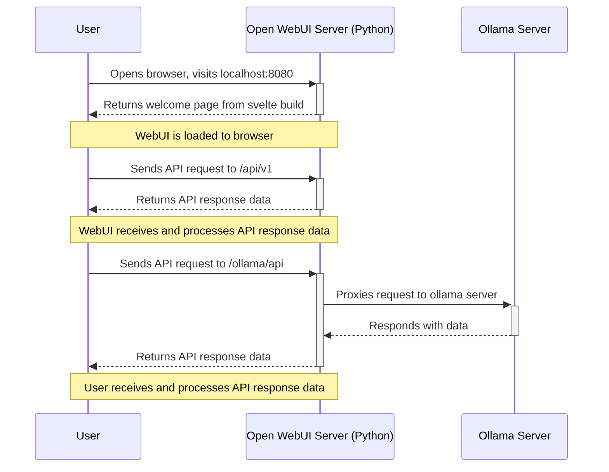
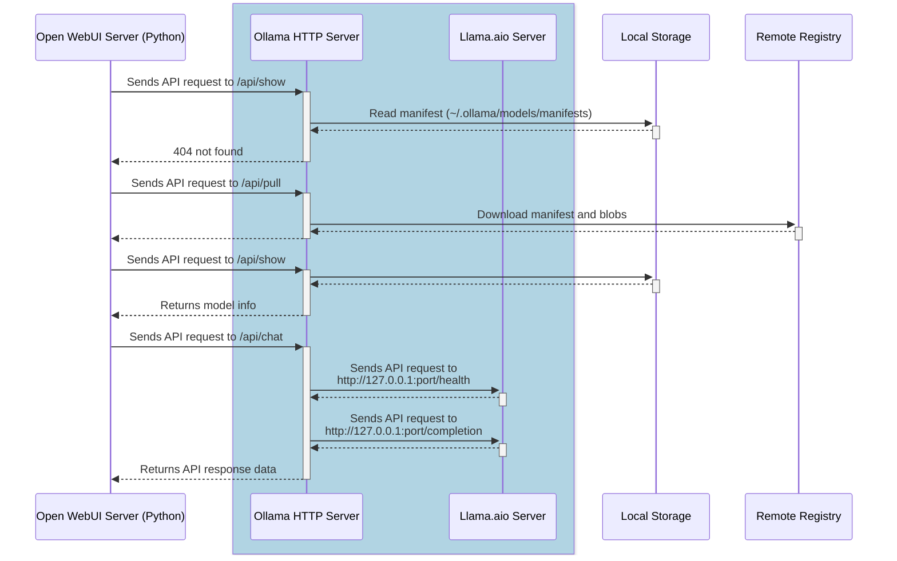

# Project Workflow

## User to Open WebUI Server to Ollama Server

```mermaid
sequenceDiagram
participant User as User
participant Openweb_UI_Server as Open WebUI Server (Python)
participant Ollama_Server as Ollama Server

User->>+Openweb_UI_Server: Opens browser, visits localhost:8080
Openweb_UI_Server-->>-User: Returns welcome page from svelte build
Note over User, Openweb_UI_Server: WebUI is loaded to browser
User->>+Openweb_UI_Server: Sends API request to /api/v1
Openweb_UI_Server-->>-User: Returns API response data
Note over User, Openweb_UI_Server: WebUI receives and processes API response data
User->>+Openweb_UI_Server: Sends API request to /ollama/api
Openweb_UI_Server->>+Ollama_Server: Proxies request to ollama server
Ollama_Server-->>-Openweb_UI_Server: Responds with data
Openweb_UI_Server-->>-User: Returns API response data
Note over User, Openweb_UI_Server: User receives and processes API response data
```

## Open WebUI Server to Ollama server to llama.cpp

```mermaid
sequenceDiagram
participant Openweb_UI_Server as Open WebUI Server (Python)
box rgba(135, 206, 235, 0.5)
participant Ollama_Server as Ollama HTTP Server
participant Llama_Cpp_Server as Llama.aio Server
end
participant Local_Storage as Local Storage
participant Remote_Registry as Remote Registry

Openweb_UI_Server->>+Ollama_Server: Sends API request to /api/show
Ollama_Server->>+Local_Storage: Read manifest (~/.ollama/models/manifests)
Local_Storage-->>-Ollama_Server: 
Ollama_Server-->>-Openweb_UI_Server: 404 not found
Openweb_UI_Server->>+Ollama_Server: Sends API request to /api/pull
Ollama_Server->>+Remote_Registry: Download manifest and blobs
Remote_Registry-->>-Ollama_Server: 
Ollama_Server-->>-Openweb_UI_Server: 
Openweb_UI_Server->>+Ollama_Server: Sends API request to /api/show
Ollama_Server->>+Local_Storage: 
Local_Storage-->>-Ollama_Server: 
Ollama_Server-->>-Openweb_UI_Server: Returns model info
Openweb_UI_Server->>+Ollama_Server: Sends API request to /api/chat
Ollama_Server->>+Llama_Cpp_Server: Sends API request to <br/> http://127.0.0.1:port/health
Llama_Cpp_Server-->>-Ollama_Server: 
Ollama_Server->>+Llama_Cpp_Server: Sends API request to <br/> http://127.0.0.1:port/completion
Llama_Cpp_Server-->>-Ollama_Server: 
Ollama_Server-->>-Openweb_UI_Server: Returns API response data

```